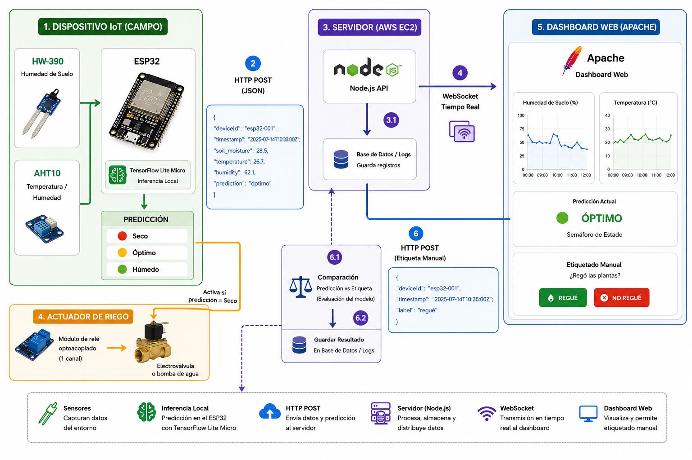
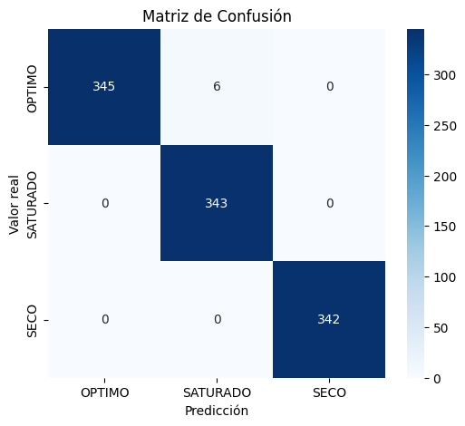
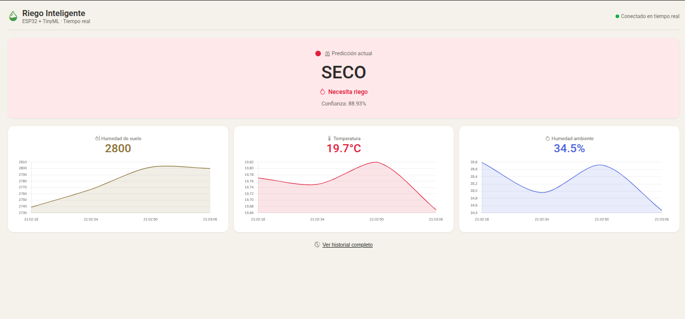

<h1 align="center">
  Sistema de Riego Inteligente con TinyML
</h1>

<p align="center">
  <b>ESP32 · TensorFlow Lite Micro · Edge AI · AWS</b>
</p>

<p align="center">
  
  
  
  
</p>

---

Sistema de riego autónomo que clasifica el estado hídrico del sustrato (**SECO**, **OPTIMO**, **SATURADO**) ejecutando inferencia **TinyML** directamente en un ESP32, sin depender de la nube para la toma de decisiones.

## Arquitectura



| Componente | Descripción |
|---|---|
| **ESP32** | Microcontrolador con sensores HW-390 (suelo) y AHT10 (temp/hum) |
| **TFLite Micro** | Modelo de red neuronal cuantizado (2.3 KB) |
| **Servidor Node.js** | Backend en AWS EC2 con WebSocket |
| **Dashboard** | Panel web en tiempo real con gráficos e historial |

## Resultados

El modelo final alcanzó **99.42 % de exactitud** sobre el conjunto de prueba (1036 muestras).

| Clase | Precisión | Recall | F1-score |
|---|---|---|---|
| OPTIMO | 1.00 | 0.99 | 0.99 |
| SATURADO | 0.99 | 1.00 | 0.99 |
| SECO | 1.00 | 1.00 | 1.00 |



## Dashboard



El panel web muestra:
- Predicción actual con indicador de color y mensaje de acción
- Gráficos en tiempo real de suelo, temperatura y humedad
- Historial completo de lecturas con tabla responsive

## Hardware

| Componente | Especificación |
|---|---|
| **Microcontrolador** | ESP32 DEVKIT V1 (WROOM-32) |
| **Sensor de suelo** | HW-390, capacitivo, GPIO34 (ADC) |
| **Sensor ambiental** | AHT10, I2C (SDA=21, SCL=22) |

## Empezar

```bash
# 1. Capturar datos
python3 captura/log_raw_data.py --estado seco --momento dia --muestras 50

# 2. Entrenar modelo (Google Colab)
entrenamiento/entrenamiento.ipynb

# 3. Flashear firmware de inferencia
cd riego_inferencia_esp32 && pio run --target upload
```

## Estructura del repositorio

```
📦 ESP32-Riego_Inteligente
├── captura/                  # Scripts de captura y etiquetado
├── entrenamiento/            # Notebook Colab + datasets
├── riego_inferencia_esp32/   # Firmware con TinyML
├── riego_datos_esp32/        # Firmware de captura de datos
├── imgs/                     # Diagramas y capturas
└── informe/                  # Informe del proyecto
```

## Licencia

Proyecto académico — Universidad Nacional de San Antonio Abad del Cusco (UNSAAC).
