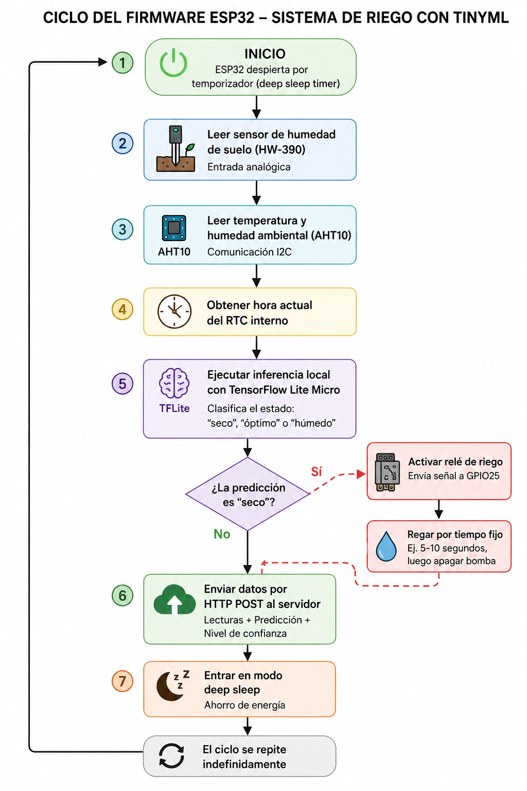

# riego_inferencia_esp32/ — Firmware de inferencia TinyML

Firmware para ESP32 que lee sensores, ejecuta el modelo TFLite Micro clasificando el estado del sustrato y envía los resultados a AWS.

## Hardware

| Sensor | Pin | Protocolo |
|---|---|---|
| HW-390 (humedad de suelo) | GPIO34 | ADC |
| AHT10 (temperatura / humedad) | SDA=21, SCL=22 | I2C |

## Flujo de operación



1. Leer sensores cada 10 segundos
2. Normalizar con `StandardScaler` (entrenado en Colab)
3. Cuantizar a enteros de 8 bits
4. Inferir con TFLite Micro (modelo de 2.3 KB)
5. Enviar resultado vía HTTP POST a AWS

## Dependencias

```
platformio.ini:
  lib_deps =
    Chirale_TensorFlowLite
    WiFiManager
    Adafruit AHTX0
```

## Compilar y flashear

```bash
cd riego_inferencia_esp32
pio run --target upload
pio device monitor
```

## Conexión WiFi

El dispositivo usa **WiFiManager**: al no encontrar credenciales guardadas, crea un punto de acceso `RiegoESP32-Setup` para configurar la red desde el celular.

## API

El ESP32 envía POST a `http://3.129.19.217:3003/api/lectura`:

```json
{
  "device_id": "esp32-001",
  "soil_raw": 2340,
  "temp": 22.5,
  "hum": 31.2,
  "prediccion": "SECO",
  "confianza": 0.982
}
```

## Estructura

```
riego_inferencia_esp32/
├── src/main.cpp           # Código principal
├── include/modelo_riego.h # Modelo TFLite cuantizado
└── platformio.ini         # Configuración del proyecto
```
